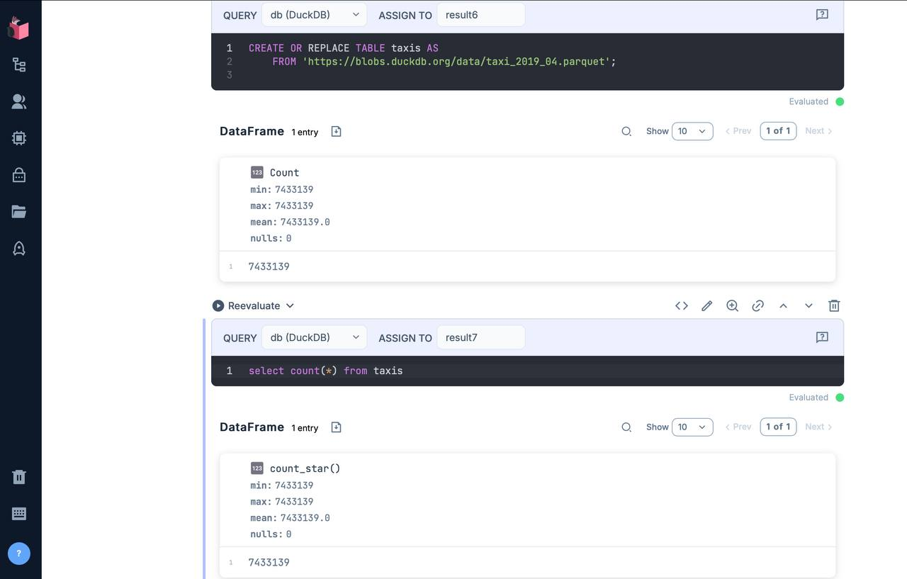

# Maaite

A proof of concept of an Embedded analytics platform for building dashboards utilizing the Elixir, Phoenix, LiveView and Livebook technologies.

## Disclaimer

This is an ongoing projet. I am creating this document to keep track of the development process and to share the knowledge with the community. All the informations here are subject to change.

## References

Please, check the following references to understand the context of this project.

* [marimo](https://marimo.io)

[GitHub](https://github.com/marimo-team/marimo) repository for the Marimo project.

*[Provide more explanation about it, and their characteristics]*.

* [Observable Framework](https://observablehq.com/platform/framework)

[GitHub](https://github.com/observablehq/framework) repository for the Observable Framework.

From the same creator of [d3js](https://d3js.org) JavaScript library for data visualization, the Obserable Framework [more].

* Metabase [Embedded Analytics](https://www.metabase.com/product/embedded-analytics)

It is not open sourced yet. But it is a good reference for the project.

*[Provide more explanation about it, and their characteristics]*.


## Objectives

The aim of this project is to create a platform for building analytical dashboards such as the references prior mentioned utilizing the Elixir, Phoenix, LiveView and Livebook technologies. The purpose is to bring the power of Elixir to the data visualization world.

It will be a platform to build analytics dashboards as dynamic web pages, utilizing the Livebook engine to create the visualizations, but instead of an interactive document, it will generate web pages with several charts, tables, and texts.

The users will build different graphics elements and pin them to appear on the central page. When appearing on the central page, it will be possible to resize them and insert text blocks, titles, and other annotations using Markdown.

They will rely on heavy utilization of SQL queries to fetch data from the database and create the indicators that will feed the visualizations. These SQL statements will be placed inside the markdown blocks.

Taking the Observable Framework as an example, loading an external data source

```yaml
---
sql:
  quakes: https://earthquake.usgs.gov/earthquakes/feed/v1.0/summary/all_day.csv
---
```

And then using the SQL to fetch the data:

```sql
SELECT * FROM gaia ORDER BY phot_g_mean_mag LIMIT 10
```

It will imedialety render the data in a table or any other kind of graphic available.

See more examples on the [Observable Framework](https://observablehq.com/framework/sql) documentation.

*[provide some more examples that expalins the use of SQL in the platform and why this is important]*

## Who will utilize this platform?

This is a tool for data analysts, business intelligent developers and data scientists to create dashboards and reports and also might embedded it on their applications.

This public takes advantage of the features such as window functions, CTEs, and other advanced SQL features to create their indicators.

## Known limitations

At this point we don't have Livebook as a mix depedency. It could be something like:


```elixir
defp deps do
  [
    {:livebook, "~> 0.1.0"}
  ]
end
```

It demands more research to understand how to transform the Livebook into a `mix deps`. Meanwhile, we will use the standalone Livebook application.

## Database support

DuckDB, SQLite, BigQuery, Parquet Delta Lake, and others. We will provide more information about the database support in the future.

### DuckDB 🦆

We will utilize the DuckDB engine as the one of the main database for the platform. It is a columnar storage database that is very fast and has a SQL interface. It is possible to load data from CSV, Parquet, and other formats. See the example below:

```sql
create or replace table taxis as
  from 'https://blobs.duckdb.org/data/taxi_2019_04.parquet'
```

It will load the data from the URL and create a table called `taxis` with the data from the Parquet file. It is possible to run SQL queries on this table and create visualizations.




### DuckDB Wasm

During the development, we will learn more about [DuckDB Wasm](https://github.com/duckdb/duckdb-wasm) and about its user cases.

## Running the app

To start your Phoenix server:

  * Run `mix setup` to install and setup dependencies
  * Start Phoenix endpoint with `mix phx.server` or inside IEx with `iex -S mix phx.server`

Now you can visit [`localhost:4000`](http://localhost:4000) from your browser.

## Motivation

I have been working on roles such as data analyst, data engineer, business intelligence developer (and some others) for a long time. I have used tools such as Tableau and Power BI. Writing SQL statements and algo some Python code on Jupyter notebook.
But I always felt that I was missing something. Aiming to have more control over the data and the visualizations, I wanted to have a tool that could be used by data analysts and data scientists to create dashboards and reports.

Since I started to learning Elixir language and the Phoenix framework, and been using it for some small projects, I am amazed by the power of the language and the framework. That's why I believe this is a great time to start this project, being able to working on the intersection of data and web development with Elixir and its ecosystem.
